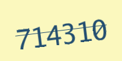
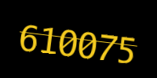
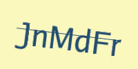
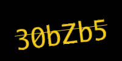
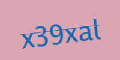
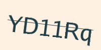

<p align="center">

</p>
<p align="center">
<a href="https://pkg.go.dev/github.com/mehditeymorian/koi/v3?tab=doc"target="_blank">
    
</a>


</p>

# captcha
a lightweight and powerful package for generating captcha pictures and keys for verifying that with a lot of options.

# Documentation
## Install
```bash
go get github.com/ErfanMomeniii/captcha
```   
Next, include it in your application:
```bash
import "github.com/ErfanMomeniii/captcha"
``` 

# Examples

Here are several examples produced images by only using default templates.


[](assets/photo/example1.png)
[](assets/photo/example2.png)
[](assets/photo/example3.png)
[](assets/photo/example4.png)
[](assets/photo/example5.png)
[](assets/photo/example6.png)
[](assets/photo/example7.png)
[](assets/photo/example8.png)
[](assets/photo/example9.png)
[](assets/photo/example10.png)
[](assets/photo/example11.png)
[](assets/photo/example12.png)
