<p align="center">
  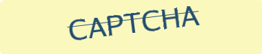
</p>

<h1 align="center">Captcha</h1>

<p align="center">
  <b>A lightweight, pure-Go CAPTCHA generator — images and audio, with verifiable keys.</b>
</p>

<p align="center">
  <a href="https://github.com/ErfanMomeniii/captcha/actions/workflows/ci.yml"></a>
  <a href="https://pkg.go.dev/github.com/ErfanMomeniii/captcha/v2"></a>
  <a href="https://pkg.go.dev/github.com/ErfanMomeniii/captcha/v2"></a>
  <a href="https://goreportcard.com/report/github.com/ErfanMomeniii/captcha/v2"></a>
  
  
</p>

<p align="center">
  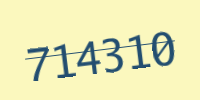
  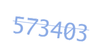
  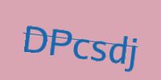
  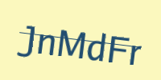
  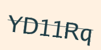
</p>

---

## Why Captcha?

- **Verifiable by design.** Every generator hands back the answer (`Result.Text`) alongside the image — store it, compare it, done. No guessing what was drawn.
- **Six image types + audio.** Numeric, alphabetical, mixed, custom charset, word list, and math — plus a mono WAV audio captcha for accessibility.
- **Secure keys.** Text keys are drawn from `crypto/rand`, not a predictable PRNG.
- **Bot-resistant.** Four tunable noise levels: per-character jitter, dots, and random lines.
- **Themeable.** Ships with color templates you can override.
- **Fast & lean.** Font parsed once and cached; a small, well-known dependency set; no CGO.

## Contents

- [Install](#install)
- [Quick start](#quick-start)
- [Verifying a user (end-to-end)](#verifying-a-user-end-to-end)
- [Captcha types](#captcha-types)
- [Audio captcha](#audio-captcha)
- [Noise levels](#noise-levels)
- [Color templates](#color-templates)
- [API reference](#api-reference)
- [Gallery](#gallery)
- [Contributing](#contributing)
- [License](#license)

## Install

```bash
go get github.com/ErfanMomeniii/captcha/v2
```

```go
import "github.com/ErfanMomeniii/captcha/v2"
```

Requires Go 1.26+.

## Quick start

The simplest path is a package-level one-liner — no setup. Every image generator
returns a `*Result`: `Result.Text` is the answer to verify against the user, and
`Result.Image` is the picture (with helpers to save, stream, or embed it).

```go
package main

import (
	"fmt"
	"os"

	"github.com/ErfanMomeniii/captcha/v2"
)

func main() {
	r, err := captcha.Numeric(6)
	if err != nil {
		panic(err)
	}

	fmt.Println("answer:", r.Text) // keep this server-side to verify the user

	// Save it as a PNG file...
	f, _ := os.Create("captcha.png")
	defer f.Close()
	_, _ = r.WriteTo(f)

	// ...or get it another way:
	// b, _ := r.PNG()       // []byte
	// uri, _ := r.DataURI() // "data:image/png;base64,..." for an 
}
```

Need to tune it? Build a generator with options:

```go
c := captcha.New(
	captcha.WithSize(320, 120),
	captcha.WithFontSize(48),
	captcha.WithNoise(captcha.NoiseMedium),
)
r, _ := c.Mixed(6)
```

`*Captcha` holds no per-request state, so a single instance is safe to share
across goroutines.

## Verifying a user (end-to-end)

A captcha is only useful if you check the answer. The pattern: generate, stash
`Result.Text` in the user's session, serve the image, then compare on submit.

```go
package main

import (
	"net/http"

	"github.com/ErfanMomeniii/captcha/v2"
)

// GET /captcha — issue a challenge and stream the PNG.
func serve(w http.ResponseWriter, r *http.Request) {
	res, err := captcha.Numeric(6)
	if err != nil {
		http.Error(w, "could not generate captcha", http.StatusInternalServerError)
		return
	}

	// Store res.Text in your session store keyed to this user.
	// (Never send the answer to the client.)
	session(r).Set("captcha", res.Text)

	w.Header().Set("Content-Type", "image/png")
	_, _ = res.WriteTo(w) // stream the PNG straight to the response
}

// POST /verify — compare the submitted answer.
func verify(w http.ResponseWriter, r *http.Request) {
	want := session(r).Get("captcha")

	if !captcha.Match(want, r.FormValue("answer")) {
		http.Error(w, "captcha failed", http.StatusForbidden)
		return
	}
	session(r).Delete("captcha") // one-time use
	w.Write([]byte("verified"))
}
```

`captcha.Match` trims whitespace and ignores case, so users don't fail on
capitalization. Here `session()` stands in for your own session store (a signed
cookie, Redis, a DB row — whatever you already use).

> **Tip:** treat each captcha as single-use and expire it after a minute or two.

## Captcha types

Each type has a **package-level one-liner** (zero config) and a **method** on a
`captcha.New(...)` generator (when you want custom size or noise).

| Type | One-liner | On a generator | `Result.Text` example |
|------|-----------|----------------|-----------------------|
| **Numeric** | `captcha.Numeric(6)` | `c.Numeric(6)` | `"480913"` |
| **Alphabetical** | `captcha.Alphabetical(6)` | `c.Alphabetical(6)` | `"RlVBhX"` |
| **Mixed** | `captcha.Mixed(6)` | `c.Mixed(6)` | `"B7xJ2b"` |
| **Custom** | `captcha.Custom(5, "ABC123")` | `c.Custom(5, "ABC123")` | `"C1BA3"` |
| **Word** | `captcha.Word([]string{"apple"})` | `c.Word([]string{"apple"})` | `"apple"` |
| **Math** | `captcha.Math()` | `c.Math()` | `"18"` (shows `3 + 15 =`) |

```go
// Custom charset — great for excluding ambiguous characters (O/0, I/l).
r, _ := captcha.Custom(6, "ABCDEFGHJKLMNPQRSTUVWXYZ23456789")

// Word list — human-friendly, memorable challenges.
r, _ = captcha.Word([]string{"tiger", "eagle", "otter"})

// Math — the image shows an expression; r.Text is the answer.
r, _ = captcha.Math()
```

`Custom`, `Word`, and `Math` validate their inputs and return an error for empty
charsets, empty word lists, or invalid dimensions.

## Audio captcha

Audio is its own type — it has no width, height, or font. Build one with
`NewAudio`, tune the sample rate and timing if you like, and call `Generate`.
It returns an `*AudioResult` with a ready-to-write mono 16-bit PCM WAV.

```go
a := captcha.NewAudio() // defaults: 8000 Hz, 0.35s per char, 0.15s gap
// a := captcha.NewAudio(captcha.WithSampleRate(16000), captcha.WithTiming(0.2, 0.05))

res, err := a.Generate("1a9")
if err != nil {
	panic(err)
}
// res.Text is "1a9" (lower-cased); res.WAV is the WAV byte slice.
_ = os.WriteFile("./captcha.wav", res.WAV, 0o644)
```

For a quick default, `captcha.Audio("1a9")` is the one-liner equivalent of
`captcha.NewAudio().Generate("1a9")`.

Characters are matched case-insensitively against `0-9` and `a-z`. Because case
can't be heard, `res.Text` is always lower-cased — compare accordingly.

> **Note:** each character is currently rendered as a distinct synthetic tone
> (deterministic and dependency-free). Embedded public-domain voice samples are a
> planned follow-up.

## Noise levels

By default a captcha keeps the original clean look (`NoiseNone`). Add distortion
with the `WithNoise` option to make images harder for bots:

```go
c := captcha.New(captcha.WithNoise(captcha.NoiseHigh))
```

| Level | Effect |
|-------|--------|
| `NoiseNone` | Rotation + baseline only (original look) |
| `NoiseLow` | + light scattered dots |
| `NoiseMedium` | + per-character jitter and extra lines |
| `NoiseHigh` | + dense dots and stronger jitter |

## Color templates

The package ships with a set of background/foreground color templates and picks
one at random per image (see [`template.go`](./template.go)). Override the global
list to match your brand:

```go
captcha.Templates = []captcha.Template{
	{Background: "#0d1117", Color: "#58a6ff"},
	{Background: "#ffffff", Color: "#24292f"},
}
```

## API reference

Full documentation lives on
[pkg.go.dev](https://pkg.go.dev/github.com/ErfanMomeniii/captcha/v2). At a glance:

**Package-level (zero config):** `Numeric`, `Alphabetical`, `Mixed`, `Custom`,
`Word`, `Math`, and `Audio` mirror the generator methods using default settings.

| Symbol | Signature | Purpose |
|--------|-----------|---------|
| `New` | `New(opts ...Option) *Captcha` | Create an image generator (defaults: 240×80, font 36) |
| `WithSize` | `WithSize(width, height int) Option` | Set image dimensions |
| `WithFontSize` | `WithFontSize(size float64) Option` | Set font size |
| `WithNoise` | `WithNoise(n Noise) Option` | Set the distortion level |
| `Match` | `Match(expected, input string) bool` | Verify an answer (case- & space-insensitive) |
| `(*Captcha).Numeric` | `Numeric(length int) (*Result, error)` | Digits |
| `(*Captcha).Alphabetical` | `Alphabetical(length int) (*Result, error)` | Letters |
| `(*Captcha).Mixed` | `Mixed(length int) (*Result, error)` | Letters + digits |
| `(*Captcha).Custom` | `Custom(length int, charset string) (*Result, error)` | Your charset |
| `(*Captcha).Word` | `Word(words []string) (*Result, error)` | One word from a list |
| `(*Captcha).Math` | `Math() (*Result, error)` | Arithmetic challenge |
| `(*Captcha).Save` | `Save(path string, im image.Image) error` | Write a PNG to disk |
| `(*Result).PNG` | `PNG() ([]byte, error)` | Encode the image as PNG bytes |
| `(*Result).WriteTo` | `WriteTo(w io.Writer) (int64, error)` | Stream PNG to any writer |
| `(*Result).DataURI` | `DataURI() (string, error)` | Base64 PNG data URI for `` |
| `NewAudio` | `NewAudio(opts ...AudioOption) *AudioCaptcha` | Create an audio generator |
| `WithSampleRate` | `WithSampleRate(hz int) AudioOption` | Set WAV sample rate |
| `WithTiming` | `WithTiming(charSeconds, gapSeconds float64) AudioOption` | Set per-char / gap durations |
| `(*AudioCaptcha).Generate` | `Generate(text string) (*AudioResult, error)` | Synthesize a WAV |

```go
type Result struct {
	Text  string      // the key/answer to verify against user input
	Image image.Image // the rendered captcha image
}

type AudioResult struct {
	Text string // the spoken key (lower-cased)
	WAV  []byte // mono 16-bit PCM WAV bytes
}
```

## Gallery

Generated with the default templates:

<p align="center">
  
  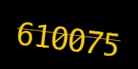
  
  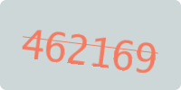
  
  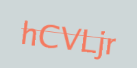
  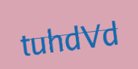
  
  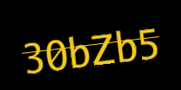
  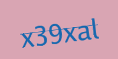
  
  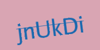
</p>

## Contributing

Issues and pull requests are welcome. Please run `go test ./...` and `gofmt -l .`
before opening a PR.

## License

Released under the [MIT License](./LICENSE).
