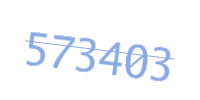
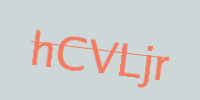
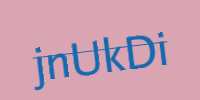

<p align="center">

</p>
<p align="center">
<a href="https://pkg.go.dev/github.com/mehditeymorian/koi/v3?tab=doc"target="_blank">
    
</a>


</p>

# Captcha
Captcha is a lightweight and powerful package for generating captcha pictures with defined keys.

# Documentation

## Install

```bash
go get github.com/ErfanMomeniii/captcha
```   

Next, include it in your application:

```bash
import "github.com/ErfanMomeniii/captcha"
``` 

## Quick Start

The following examples demonstrates how to generate captcha image with ideal width, height and font weight:

### 1. Numeric Captcha

```go
package main

import (
	"github.com/ErfanMomeniii/captcha"
)

func main() {
	c := captcha.New(300, 400, 40)

	im, _ := c.Numeric(6)
	// im is a numeric captcha that has a numeric word of 
	// length six in it

	c.save("./", im)
	// it saves image (im) in the input path
}

```

### 2. Alphabetical Captcha

```go
package main

import (
	"github.com/ErfanMomeniii/captcha"
)

func main() {
	c := captcha.New(300, 400, 40)

	im, _ := c.Alphabetical(6)
	// im is a Alphabetical captcha that has an alphabetical word of 
	// length six in it

	c.save("./", im)
	// it saves image (im) in the input path
}

```

### 3. Mixed Captcha

```go
package main

import (
	"github.com/ErfanMomeniii/captcha"
)

func main() {
	c := captcha.New(300, 400, 40)

	im, _ := c.Alphabetical(6)
	// im is a Mixed captcha that has a mixed word of 
	// length six in it (combination of alphabets and numbers)

	_ = c.save("./", im)
	// it saves image (im) in the input path
}

```

:warning: This package uses some defined templates for choosing random template from those(you can those see in [this](./template.go)) that can customize by the
following :

```go
package main

import (
	"github.com/ErfanMomeniii/captcha"
)

func main() {
	captcha.Templates = []captcha.Template{
		{
			Background: "#ffffff",
			Color:      "#000000",
		},
	}
}

```

## Examples

Here are several examples of generated captcha images by only using default templates.

[](assets/photo/example1.png)
[](assets/photo/example2.png)
[](assets/photo/example3.png)
[](assets/photo/example4.png)
[](assets/photo/example5.png)
[](assets/photo/example6.png)
[](assets/photo/example7.png)
[](assets/photo/example8.png)
[](assets/photo/example9.png)
[](assets/photo/example10.png)
[](assets/photo/example11.png)
[](assets/photo/example12.png)
